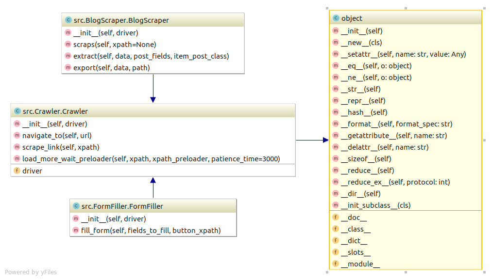

***
webcrawler-rdp
==============================
# Teste RDP - Desenvolvedor Python
Web Crawler Teste - Selenium, webdriver, python, beautifulsoup
***

***
## Instruções 
***
> 1. criar ambiente virtual (opcional)
>	- `make create_environment`
>
> 2. instalar dependências
> 	- `pip install -r requirements.txt`
>
> 3. baixar e descompactar webdriver (Chrome) compatível com a versão do seu navegador
>
> 4. criar .env e adicionar variáveis (opcional):
>	- chromedriver_path=local/do/webdriver 
>	- valores dos campos do formulário a ser preenchido
> 5. no diretório raiz do projeto ative o ambiente de desenvolvimento e rode `python -m src.main`
***
## Checklist
***

- ✅ Criar uma ou mais classes para o mapeamento dos elementos em métodos;
- ✅ Criar o arquivo 'main' para execução das classes;

- Fluxo a ser automatizado é :
    - ✅ Entrar no site: http://www.csa-ma.com.br/;
    - ✅ Acessar a aba 'blog';
    - ✅ Clicar no botão 'mais notícias' até carregar todas as notícias do blog;
    - ✅ Pegar as informações de título, data de postagem, resumo e url da imagem de forma programática;
    - ✅ Armazenar em um arquivo csv;

- ✅ Preencher todos os campos do formulário de contato com seus dados;
- ✅ No campo 'mensagem' escrever porque você gostaria de fazer parte do time da RDP;
- ✅ Enviar mensagem;

 Organização do Projeto
------------

    ├── LICENSE
    ├── Makefile           <- Makefile com comandos úteis como `make create_environment` or `make clean`
    ├── README.md          <- The top-level README for developers using this project.
    ├── data		   <- Onde os dados são armazenados
    │   
    ├── requirements.txt   <- The requirements file for reproducing the analysis environment, e.g.
    │                         generated with `pip freeze > requirements.txt`
    │
    ├── setup.py           <- makes project pip installable (pip install -e .) so src can be imported
    ├── src                <- Source code for use in this project.
    │   ├── __init__.py    <- Makes src a Python module
    │   │
    │   ├── Crawler.py     <- Classe genérica de web crawler
    │   │   
    │   ├── BlogScraper.py <- Classe que herda de Crawler com propósito de raspar dados de blog.
    │   │   
    │   ├── FormFiller.py  <- Classe que herda de Crawler com propósito de preencher e enviar formulário
    │   
    └── tox.ini            <- tox file with settings for running tox; see tox.readthedocs.io

--------

<small>Project based on the <a target="_blank" href="https://drivendata.github.io/cookiecutter-data-science/">cookiecutter data science project template</a>. #cookiecutterdatascience</small>

